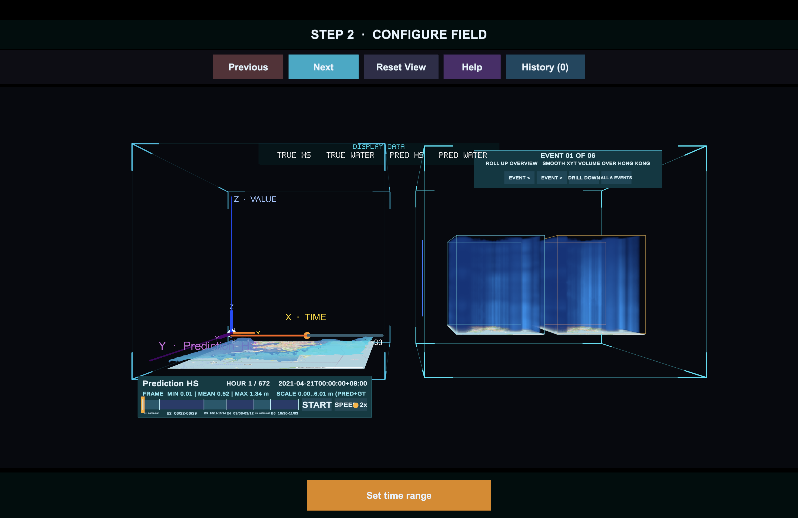
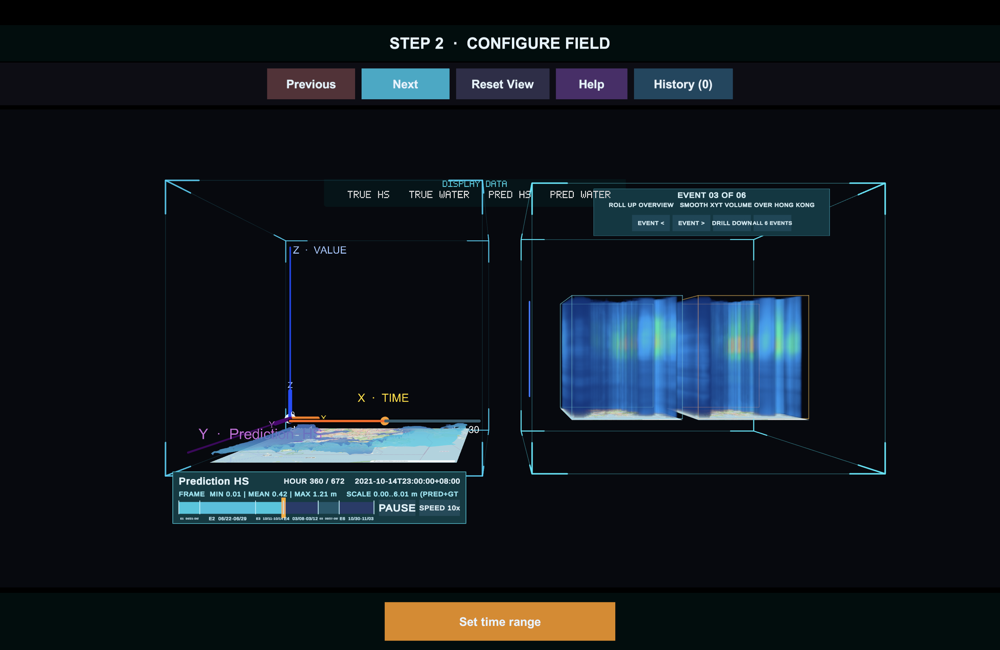

# STC SlabLab

STC SlabLab is an interactive desktop and VR application for exploring
spatiotemporal volume data. It combines a Unity space-time cube viewer, a local
S4D analysis service, and a MatPlotAgent-based chart generator so a user can
load a dataset, choose a time range and variables, generate Matplotlib views,
and review model-assisted findings in one guided workflow.

The latest working version of this project is maintained in:

```text
https://github.com/cyt2023/STC-SlabLab-XR-4
```

## Download the Packaged App

The current macOS review build is packaged here:

[Download SlabLab-Review-macOS.zip](docs/downloads/SlabLab-Review-macOS.zip)

Local build artifact:

```text
RenderingModule/Builds/SlabLab-Review-macOS.zip
```

For a public release, upload the same zip file to GitHub Releases and replace
the relative link above with the release asset URL. The `RenderingModule/Builds`
directory is intentionally ignored by Git because Unity builds can become large;
the copy under `docs/downloads/` is included so this README has a working
download link in the repository.

## Runtime Screenshots

The desktop app uses a linear workflow. Users move through dataset selection,
field configuration, slab definition, matrix review, chart generation, and
findings review.



The visualization page keeps the active space-time view, comparison volume, time
controls, variable switcher, and history access visible without overlapping
text-heavy panels.



## What the App Does

- Loads RAW/INI spatiotemporal datasets through the Unity VolumeSTCube pipeline.
- Supports both `XY + time` and `XYZ + time` layouts.
- Shows a guided desktop flow for dataset import, field setup, time selection,
  slab definition, matrix review, analysis, and findings.
- Starts and uses local backend services for S4D analysis and MatPlotAgent chart
  generation.
- Produces Matplotlib chart grids from validated data contracts instead of
  sending ambiguous free-form prompts.
- Keeps analysis history in the current session so a user can inspect more than
  one variable or result without losing previous charts.
- Also keeps the Quest/OpenXR path for VR experiments.

## Quick Start on macOS

1. Download `SlabLab-Review-macOS.zip` from the link above.
2. Unzip it and open `SlabLab-Review.app`.
3. The app expects the local backend environment to be ready in this repository.
   On the development machine, the backend has already been configured with:

```text
.venv/.stc-slablab-ready
```

The two local services are:

```text
MatPlotAgent API:       http://127.0.0.1:8010/health
S4D Analysis Service:   http://127.0.0.1:8020/health
```

For a clean machine, configure the Python environment first:

```bash
./Start-Backend.sh
```

Additional setup notes are in [docs/BACKEND_SETUP.zh-CN.md](docs/BACKEND_SETUP.zh-CN.md).

## User Workflow

The desktop workflow is intentionally linear:

```text
Open Dataset
→ Configure Field
→ Define Slab
→ Review Matrix
→ Analyze
→ Review Findings
```

The current design keeps the interface clear and visible: short button labels,
large central visualization, a compact bottom action bar, and an analysis
history button for returning to earlier results.

## Architecture

```text
Unity Desktop / VR App
        |
        | dataset, time range, variable, analysis request
        v
S4D Analysis Service
        |
        | validated grid contract + numeric CSV package
        v
MatPlotAgent Local API
        |
        | generated Matplotlib chart + result metadata
        v
Unity chart panel and findings view
```

Important project paths:

```text
RenderingModule/                         Unity project
RenderingModule/Assets/VolumeSTCubeAPI/  Desktop, VR, loading, and analysis UI
Services/S4DAnalysisService/             Dataset validation and analysis API
Services/MatPlotAgent/                   Localized MatPlotAgent runner/API
datasets/                                Versioned demo dataset manifests
docs/                                    Setup notes, release notes, screenshots
```

Open the Unity project from:

```text
RenderingModule/
```

Main scene:

```text
RenderingModule/Assets/Scenes/mainScene.unity
```

Unity version:

```text
2022.3.62f3
```

## Building

From Unity, use the desktop build menu:

```text
VolumeSTCube > Desktop > Build macOS Review
```

The current review app is produced at:

```text
RenderingModule/Builds/SlabLab-Review.app
```

Package it as a zip with:

```bash
ditto -c -k --sequesterRsrc --keepParent \
  RenderingModule/Builds/SlabLab-Review.app \
  RenderingModule/Builds/SlabLab-Review-macOS.zip
```

The older full macOS package path is still available for the previous
distribution workflow:

```text
RenderingModule/Builds/STC-SlabLab-macOS.zip
```

## Validation Status

Recent release-prep checks include:

- S4D backend robustness tests for invalid manifests, duplicate buckets,
  ambiguous cell IDs, upload cleanup, and MatPlotAgent queue saturation.
- Unity edit-mode validation for analysis history snapshot isolation.
- macOS review build generation.
- Local backend health checks for ports `8010` and `8020`.

The remaining manual QA item is a full click-through run on the target machine:
dataset selection, time range, variable selection, chart generation, history
reopen, and findings review.

## References and Upstream Projects

This repository integrates and extends the following work:

- [VolumeSTCube](https://github.com/Kapo-Huang/VolumeSTCube), the original Unity
  volume-based space-time cube project used as the rendering foundation.
- Zikun Deng, Jiabao Huang, Chenxi Ruan, Jialing Li, Shaowu Gao, and Yi Cai.
  "Volume-Based Space-Time Cube for Large-Scale Continuous Spatial Time Series."
  IEEE Transactions on Visualization and Computer Graphics, 2025.
  DOI: [10.1109/TVCG.2025.3537115](https://doi.org/10.1109/TVCG.2025.3537115);
  arXiv: [2507.09917](https://arxiv.org/abs/2507.09917).
- [THUNLP/MatPlotAgent](https://github.com/thunlp/MatPlotAgent), localized here
  as the chart-generation backend.
- Zhiyu Yang, Zihan Zhou, Shuo Wang, Xin Cong, Xu Han, Yukun Yan, Zhenghao Liu,
  Zhixing Tan, Pengyuan Liu, Dong Yu, Zhiyuan Liu, Xiaodong Shi, and Maosong
  Sun. "MatPlotAgent: Method and Evaluation for LLM-Based Agentic Scientific
  Data Visualization." arXiv: [2402.11453](https://arxiv.org/abs/2402.11453),
  2024.

BibTeX for MatPlotAgent, copied from the upstream project:

```bibtex
@misc{yang2024matplotagent,
      title={MatPlotAgent: Method and Evaluation for LLM-Based Agentic Scientific Data Visualization},
      author={Zhiyu Yang and Zihan Zhou and Shuo Wang and Xin Cong and Xu Han and Yukun Yan and Zhenghao Liu and Zhixing Tan and Pengyuan Liu and Dong Yu and Zhiyuan Liu and Xiaodong Shi and Maosong Sun},
      year={2024},
      eprint={2402.11453},
      archivePrefix={arXiv},
      primaryClass={cs.CL}
}
```

## More Documentation

- [Desktop / VR mode guide](docs/FLAT_SCREEN.zh-CN.md)
- [Backend setup](docs/BACKEND_SETUP.zh-CN.md)
- [S4D readiness notes](docs/release/READINESS.zh-CN.md)
- [Desktop polish plan](docs/release/DESKTOP-POLISH-PLAN.zh-CN.md)
- [S4D service README](Services/S4DAnalysisService/README.md)
- [MatPlotAgent localization README](Services/MatPlotAgent/README.md)
