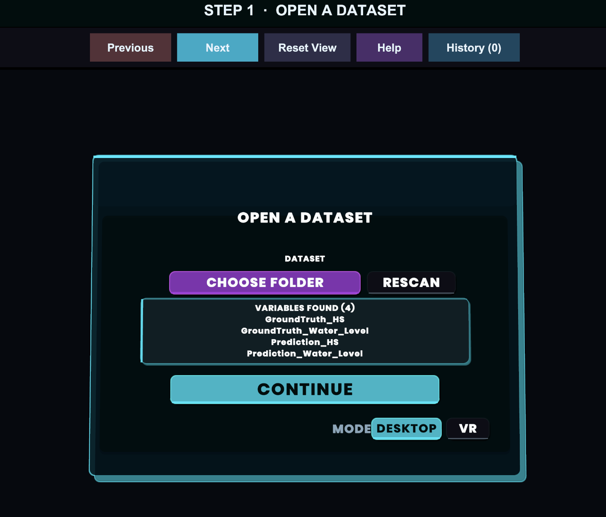
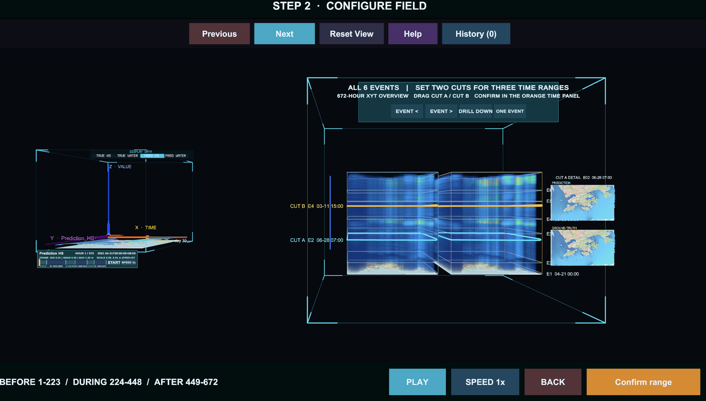
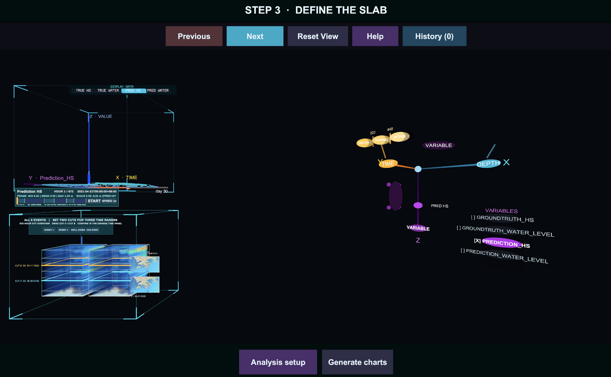
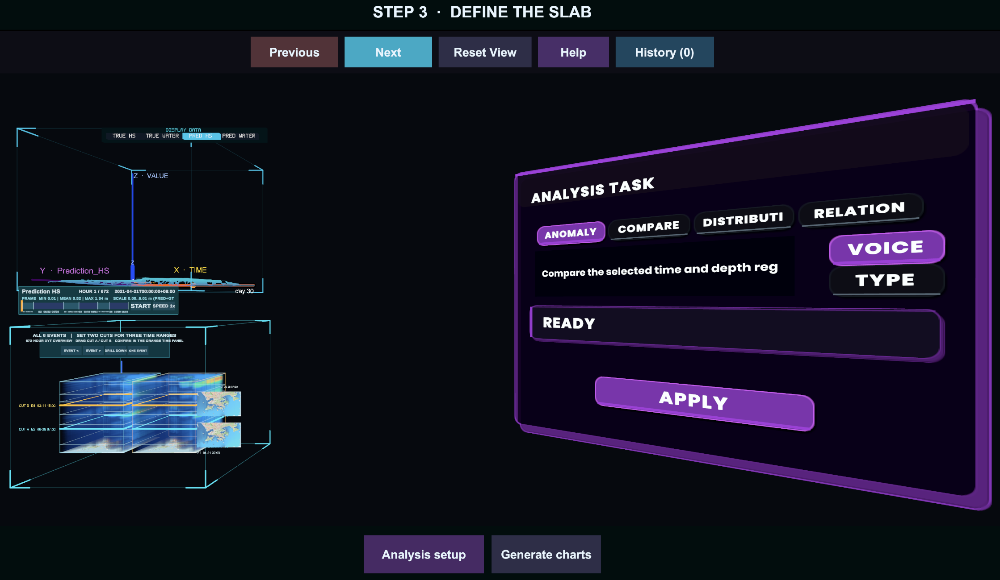
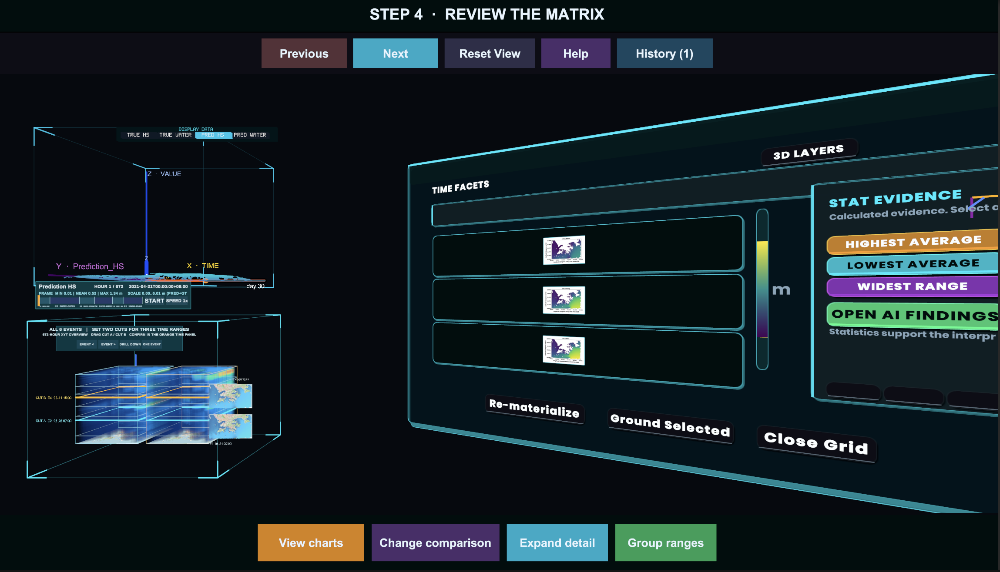

# STC SlabLab

STC SlabLab is an interactive desktop and VR application for exploring
spatiotemporal volume data. It combines a Unity space-time cube viewer, a local
S4D analysis service, and a MatPlotAgent-based chart generator so a user can
load a dataset, choose a time range and variables, generate Matplotlib views,
and review model-assisted findings in one guided workflow.

The latest working version of this project is maintained in:

```text
https://github.com/cyt2023/STC-SlabLab-XR-4
```

## Download the Packaged App

The current macOS review build is published on GitHub Releases:

[Download SlabLab-Review-macOS.zip](https://github.com/cyt2023/STC-SlabLab-XR-4/releases/download/v0.1.0-review-20260918/SlabLab-Review-macOS.zip)

Local build artifact:

```text
RenderingModule/Builds/SlabLab-Review-macOS.zip
```

The release page is:

```text
https://github.com/cyt2023/STC-SlabLab-XR-4/releases/tag/v0.1.0-review-20260918
```

The `RenderingModule/Builds` directory is intentionally ignored by Git because
Unity builds can become large. Release builds should be distributed through
GitHub Releases.

## Runtime Screenshots

The desktop app uses a linear workflow. Users move through dataset selection,
field configuration, slab definition, matrix review, chart generation, and
findings review.

### 1. Open a dataset



### 2. Configure the time range



### 3. Define the slab and variables



### 4. Set the analysis task



### 5. Review the matrix and findings



The visualization pages keep the active space-time view, comparison volume,
time controls, variable switcher, chart actions, and history access visible
without overlapping text-heavy panels.

## What the App Does

- Loads RAW/INI spatiotemporal datasets through the Unity VolumeSTCube pipeline.
- Supports both `XY + time` and `XYZ + time` layouts.
- Shows a guided desktop flow for dataset import, field setup, time selection,
  slab definition, matrix review, analysis, and findings.
- Starts and uses local backend services for S4D analysis and MatPlotAgent chart
  generation.
- Produces Matplotlib chart grids from validated data contracts instead of
  sending ambiguous free-form prompts.
- Keeps analysis history in the current session so a user can inspect more than
  one variable or result without losing previous charts.
- Also keeps the Quest/OpenXR path for VR experiments.

## Quick Start on macOS

1. Download `SlabLab-Review-macOS.zip` from the link above.
2. Unzip it and open `SlabLab-Review.app`.
3. The app expects the local backend environment to be ready in this repository.
   On the development machine, the backend has already been configured with:

```text
.venv/.stc-slablab-ready
```

The two local services are:

```text
MatPlotAgent API:       http://127.0.0.1:8010/health
S4D Analysis Service:   http://127.0.0.1:8020/health
```

### Wave server data

The dataset screen can open a live 24-hour `hs` and `elev` timeline from the
private Wave API. Field values are not pre-downloaded: selecting a variable and
hour requests only that visible frame, and each 100-node response patch is drawn
as soon as it arrives. Completed frames are cached locally. Keep Tailscale
connected, copy `.env.example` to `.env`, and set the personal `WAVE_API_KEY`
before starting the backend. The key stays in the local Python service and is
not embedded in the Unity project or app build.

The opening screen defaults to `2019-11-30T00:00:00Z` through
`2019-12-01T00:00:00Z`. These values can be changed before launch through the
Unity PlayerPrefs keys `VolumeSTCube.Wave.StartUtc` and
`VolumeSTCube.Wave.EndUtc`. One import is limited to 31 days; requests are
automatically split to respect the server's node and row limits.

For a clean machine, configure the Python environment first:

```bash
./Start-Backend.sh
```

Additional setup notes are in [docs/BACKEND_SETUP.zh-CN.md](docs/BACKEND_SETUP.zh-CN.md).

## User Workflow

The desktop workflow is intentionally linear:

```text
Open Dataset
→ Configure Field
→ Define Slab
→ Review Matrix
→ Analyze
→ Review Findings
```

The current design keeps the interface clear and visible: short button labels,
large central visualization, a compact bottom action bar, and an analysis
history button for returning to earlier results.

## Architecture

```text
Unity Desktop / VR App
        |
        | dataset, time range, variable, analysis request
        v
S4D Analysis Service
        |
        | validated grid contract + numeric CSV package
        v
MatPlotAgent Local API
        |
        | generated Matplotlib chart + result metadata
        v
Unity chart panel and findings view
```

Important project paths:

```text
RenderingModule/                         Unity project
RenderingModule/Assets/VolumeSTCubeAPI/  Desktop, VR, loading, and analysis UI
Services/S4DAnalysisService/             Dataset validation and analysis API
Services/MatPlotAgent/                   Localized MatPlotAgent runner/API
datasets/                                Versioned demo dataset manifests
docs/                                    Setup notes, release notes, screenshots
```

### Inside `Assets/VolumeSTCubeAPI/`

The desktop/VR workspace is one partial class spread over 23 files, named by the
concern each one owns:

| File | Owns |
|---|---|
| `VolumeSTCubeQuestSpatialWorkbench.cs` | Unity lifecycle, unchanged field declarations and public state |
| `…Workflow.cs` | step navigation, restart and workspace transitions |
| `…Panels.cs` | shared panel construction and stage presentation |
| `…Dataset.cs` | Wave registration, manifests, variable loading |
| `…Boundary.cs` | time/depth boundaries and the typed Time range |
| `…DesktopLayout.cs` | desktop framing, focus views, Reset view |
| `…Interaction.cs` | shortcut entry point and remaining input actions |
| `…Speech.cs` | keyboard, microphone, transcription and native Quest speech |
| `…Field.cs` | field visibility, depth inspection, animation and Ground evidence |
| `…Timeline.cs` | playback and time markers |
| `…AxisComposer.cs` | the tri-axis composer of Step 3 |
| `…Analysis.cs` | intent resolution, S4D / MatPlot requests and job callbacks |
| `…Matrix.cs` | facet grid presentation, selection, progress and placement |
| `…Draft.cs` | pivot, drill, roll-up and source-preview authoring |
| `…Buckets.cs` | index ranges, bucket copying, splitting and merging |
| `…History.cs` | analysis nodes, retained results, pinning and trail |
| `…Findings.cs` | digest summaries, statistics and findings presentation |
| `…Jobs.cs`, `…Phase.cs`, `…State.cs` | pending-job bookkeeping, the read-only `Phase` view, the grouped state structs |
| `…Chrome.cs`, `…Palette.cs`, `…Quest.cs` | drawing helpers and typography, the variable palette, VR/Quest specifics |

Small single-purpose helpers sit beside it: `SlabLabShortcuts` (key table),
`SlabLabHints` (hover texts), `SlabLabSnapshot` (export), `SlabLabBoundaryEntry`
(typed range), `SlabLabLayout` (pinned layout numbers) and `SlabLabSettings`
(persisted keys).

This split preserves member bodies, field initialization order, the Unity script
GUID and runtime contracts. Verification and the remaining device-only checks
are recorded in [docs/REFACTOR-VERIFICATION.zh-CN.md](docs/REFACTOR-VERIFICATION.zh-CN.md).

Guards live in `Assets/Editor/`, and the process that runs them — with the
allow-list for interaction changes — is in
[docs/INTERACTION-GUARDRAILS.md](docs/INTERACTION-GUARDRAILS.md).

Open the Unity project from:

```text
RenderingModule/
```

Main scene:

```text
RenderingModule/Assets/Scenes/mainScene.unity
```

Unity version:

```text
2022.3.62f3
```

## Building

From Unity, use the desktop build menu:

```text
VolumeSTCube > Desktop > Build macOS Review
```

The current review app is produced at:

```text
RenderingModule/Builds/SlabLab-Review.app
```

Package it as a zip with:

```bash
ditto -c -k --sequesterRsrc --keepParent \
  RenderingModule/Builds/SlabLab-Review.app \
  RenderingModule/Builds/SlabLab-Review-macOS.zip
```

The older full macOS package path is still available for the previous
distribution workflow:

```text
RenderingModule/Builds/STC-SlabLab-macOS.zip
```

## Validation Status

Run everything with one command:

```bash
./tools/release-check.sh            # contracts + backend tests + Unity guards
./tools/release-check.sh --package  # also verify the macOS delivery is current
./tools/release-check.sh --stall    # also prove the 45 s stall window (needs 45 s)
./tools/release-check.sh --vr       # also run the Quest/VR branch
```

It drives the Unity guards through the open editor's own menu item (or in batch
mode when the editor is closed) and writes `.runtime/test-results/release-check.txt`.
With `--package` it also refuses a delivery whose shipped interface is older than
the code. The frozen contracts and the allow-list for interaction changes are in
[docs/INTERACTION-GUARDRAILS.md](docs/INTERACTION-GUARDRAILS.md).

Recent release-prep checks include:

- S4D backend robustness tests for invalid manifests, duplicate buckets,
  ambiguous cell IDs, upload cleanup, and MatPlotAgent queue saturation.
- Both halves of the hybrid Wave source have been exercised against the packaged
  service: a bundled window answers `source: cache` with no network, and an
  **unbundled** window registers through the tailnet gateway as `source: live`
  and serves real values on demand (`0.107`, `0.128`, `0.142` for three nodes) —
  which is what the opening screen's `DATA SOURCE · LIVE` line reports.
- Unity edit-mode validation for analysis history snapshot isolation.
- Interaction baseline in Play Mode: recorded Field-pair/tri-axis bounds, phase,
  pending jobs, timing budgets, the Step 1 data-source line, the typed Time
  range, the Reset-view recovery probe, and the Snapshot export.
- Cold start of the shipped bundle: the app starts its own backend and
  `WatchWaveImport` recovers from the first-registration race without the
  operator pressing RETRY.
- The packaged tooling that ships beside the app has been exercised by hand:
  `Setup Backend.command` (a real dependency install), `Start STC
  SlabLab.command`, `Stop Backend.command` (stops both services by PID and frees
  both ports), and `Prepare Offline Data.command` (idempotent when the window is
  already bundled — it answers from the cache, rewrites only `bundle.json`, and
  the packaged app still opens offline with real values afterwards).
- macOS review build generation.
- Local backend health checks for ports `8010` and `8020`.

The remaining manual QA item is a full click-through run on the target machine:
dataset selection, time range, variable selection, chart generation, history
reopen, and findings review.

## References and Upstream Projects

This repository integrates and extends the following work:

- [VolumeSTCube](https://github.com/Kapo-Huang/VolumeSTCube), the original Unity
  volume-based space-time cube project used as the rendering foundation.
- Zikun Deng, Jiabao Huang, Chenxi Ruan, Jialing Li, Shaowu Gao, and Yi Cai.
  "Volume-Based Space-Time Cube for Large-Scale Continuous Spatial Time Series."
  IEEE Transactions on Visualization and Computer Graphics, 2025.
  DOI: [10.1109/TVCG.2025.3537115](https://doi.org/10.1109/TVCG.2025.3537115);
  arXiv: [2507.09917](https://arxiv.org/abs/2507.09917).
- [THUNLP/MatPlotAgent](https://github.com/thunlp/MatPlotAgent), localized here
  as the chart-generation backend.
- Zhiyu Yang, Zihan Zhou, Shuo Wang, Xin Cong, Xu Han, Yukun Yan, Zhenghao Liu,
  Zhixing Tan, Pengyuan Liu, Dong Yu, Zhiyuan Liu, Xiaodong Shi, and Maosong
  Sun. "MatPlotAgent: Method and Evaluation for LLM-Based Agentic Scientific
  Data Visualization." arXiv: [2402.11453](https://arxiv.org/abs/2402.11453),
  2024.

BibTeX for MatPlotAgent, copied from the upstream project:

```bibtex
@misc{yang2024matplotagent,
      title={MatPlotAgent: Method and Evaluation for LLM-Based Agentic Scientific Data Visualization},
      author={Zhiyu Yang and Zihan Zhou and Shuo Wang and Xin Cong and Xu Han and Yukun Yan and Zhenghao Liu and Zhixing Tan and Pengyuan Liu and Dong Yu and Zhiyuan Liu and Xiaodong Shi and Maosong Sun},
      year={2024},
      eprint={2402.11453},
      archivePrefix={arXiv},
      primaryClass={cs.CL}
}
```

## More Documentation

- [Desktop / VR mode guide](docs/FLAT_SCREEN.zh-CN.md)
- [Quest headset checklist](docs/QUEST-HEADSET-CHECKLIST.md)
- [Interaction guardrails](docs/INTERACTION-GUARDRAILS.md)
- [Open decisions](docs/OPEN-DECISIONS.md)
- [Backend setup](docs/BACKEND_SETUP.zh-CN.md)
- [S4D readiness notes](docs/release/READINESS.zh-CN.md)
- [Desktop polish plan](docs/release/DESKTOP-POLISH-PLAN.zh-CN.md)
- [S4D service README](Services/S4DAnalysisService/README.md)
- [MatPlotAgent localization README](Services/MatPlotAgent/README.md)
